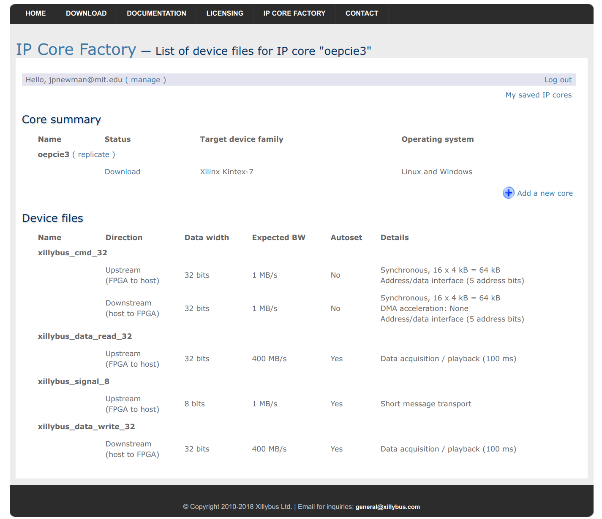

# `onidriver_xillybus` Hardware Translation Driver

[Xillybus](http://xillybus.com/) is a company that provides closed-source (but
monetarily-free for academic use) FPGA IP cores as well as free and open-source
device drivers that abstract PCIe communication to the level of system IO
calls. For this reason, Xillybus IP Cores and drivers can be used as a high
performance PCIe-based backend. A custom, completely open-source solution is in
the works, but it is currently not available. `onidriver_xillybus` is designed
to use Xillybus to implement the [ONI](https://github.com/jonnew/ONI) Host
Communication Insterconnect using the Hardware Translation Driver
specification. This driver translates Xillybus specific interfaction to
higher-level API calls by implementing all the functions in `onidriver.h`.  The
following steps show how to generate IP cores and obtain device drivers that
will function with `onidriver_xillybus` Both Windows and Linux hosts are
supported.

## Building the library
### Linux
```
make                # Build without debug symbols
sudo make install   # Install in /usr/local and run ldconfig to update library cache
make help           # list all make options
```

### Windows
Run the project in Visual Studio

## Driver Options
### `ONI_XILLYBUS_CONFIGSTREAMPATH`\*
Obtain path specifying config data stream.

| | |
|---------------------|--------------------------------------------------------------------|
| option value type   | `char *` |
| access              | R/W |
| option description  | A character string specifying the configuration stream path |
| default value       | /dev/xillybus_oni_config_32, \\\\.\\xillybus_oni_config_32 (Windows) |

### `ONI_XILLYBUS_SIGNALSTREAMPATH`\*
Obtain path specifying hardware signal data stream

| | |
|---------------------|--------------------------------------------------------------------|
| option value type   | `char *` |
| access              | R/W |
| option description  | A character string specifying the signal stream path |
| default value       | /dev/xillybus_oni_signal_8, \\\\.\\xillybus_oni_signal_8 (Windows) |

### `ONI_XILLYBUS_READSTREAMPATH`\*
Obtain path specifying input data stream.

| | |
|---------------------|--------------------------------------------------------------------|
| option value type   | `char *` |
| access              | R/W |
| option description  | A character string specifying the input stream path |
| default value       | /dev/xillybus_oni_input_32 \\\\.\\xillybus_oni_input_32 (Windows) |

### `ONI_XILLYBUS_WRITESTREAMPATH`\*
Obtain path specifying input data stream.

| | |
|---------------------|--------------------------------------------------------------------|
| option value type   | `char *` |
| access              | R/W |
| option description  | A character string specifying the output stream path |
| default value       | /dev/xillybus_oni_output_32, \\\\.\\xillybus_oni_output_32 (Windows) |


## Generating HDL IP Cores
1. Make a [Xillybus account](http://xillybus.com/ipfactory/signup)
1. Visit the [Xillybus IP Core Factory](http://xillybus.com/ipfactory/)
1. Fill out the following information in the IP Core Factory form
    - IP Core's Name: oepcie
    - Target device family: Xilinx Kintex 7
    - Intial template: Empty
    - Operating system: Windows and Linux OR Linux OR Windows depending on your requirements

	 

1. After the core has been generated, create 3 device files for the core with
   the following settings
    - `xillybus_oni_config_32`

    

    - `xillybus_oni_signal_8`

    

    - `xillybus_oni_input__32`

    

    - `xillybus_oni_output_32`

    
1. Generate the core for use in your host firmware.

## Obtaining Host Device Driver
### Linux
If you are using fairly recent Linux kernel, the driver is included
automatically. Otherwise, have a look at [Getting started with Xillybus on a
Linux
host](http://xillybus.com/downloads/doc/xillybus_getting_started_linux.pdf) for
manual installation instructions. The driver can be downloaded
[here](http://xillybus.com/downloads/xillybus.tar.gz).

### Windows
The Xillybus device driver will need to be manually associated with the PCIe
device. Installation instructions can be found in the [Getting started with
Xillybus on a Windows
host](http://xillybus.com/downloads/doc/xillybus_getting_started_windows.pdf).
The driver can downloaded
[here](http://xillybus.com/downloads/xillybus-windriver-1.2.0.0.zip).


