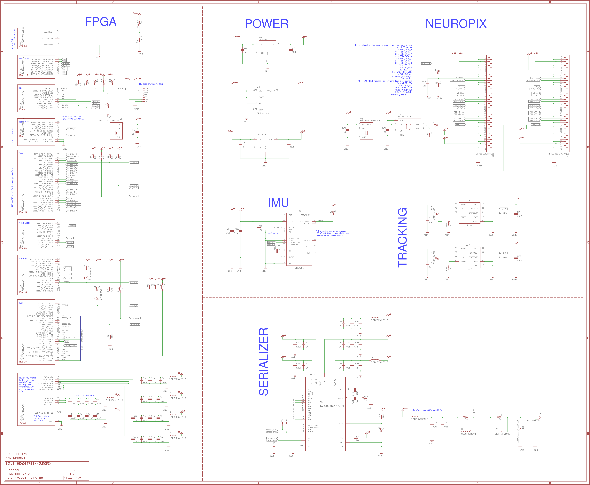

# headstage-neuropix
Serialized, multifunction headstage targeting the neuropixels 1.0 probe. This
headstages supports serialized acqusition from:

- Two neuropixels 1.0 probes.
- A BNO055 9-axis IMU for real-time, 3D orientation tracking.
- Two TS4231 light to digital converters for real-time, 3D position tracking
  with HTC Vive base stations
- A high performance MAX10 FPGA for real-time processing

## Schematic

## Gerber Files


## Bill of Materials
The BOM is located on [this google
sheet](https://docs.google.com/spreadsheets/d/1F-KWcdvH_63iXjZf0cgCfDiFX6XXW3qw6rlR8DZrFpQ/edit#gid=1284354220)
