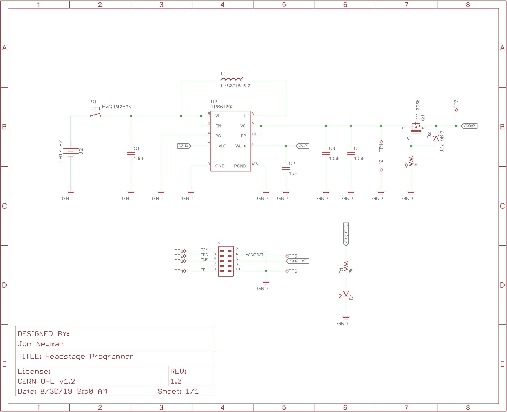

# headstage-programmer
JTAG breakout for the [Intel USB Blaster
2](https://www.digikey.com/short/qqw7hm) used to program the headstages' MAX10
FPGA.

## Schematic

## Purpose
The dense layout required by the headstages in this repository makes exposing a
FPGA programming interface challenging. We have chosen to expose a JTAG
programming interface as a linear, 50 mil pitch array of small copper ["test
points"](https://en.wikipedia.org/wiki/Test_point). This programmer adapter
routes JTAG signals through a set of small ["pogo
pins"](https://en.wikipedia.org/wiki/Pogo_pin) that can reliably make a
temporary electrical connection with the test point array. Additionally, it
contains a AAA battery and boost converter to generate power for the headstage
during programming and to illuminate a white LED on the bottom of the board
that eases pogo-pin/test-point alignment.

## Gerber Files


## BOM
The BOM is located on [this google
sheet](https://docs.google.com/spreadsheets/d/1F-KWcdvH_63iXjZf0cgCfDiFX6XXW3qw6rlR8DZrFpQ/edit#gid=673969549).

## License
Copyright Jonathan P. Newman 2017.

This documentation describes Open Hardware and is licensed under the
CERN OHL v.1.2.

You may redistribute and modify this documentation under the terms of the CERN
OHL v.1.2. (http://ohwr.org/cernohl). This documentation is distributed WITHOUT
ANY EXPRESS OR IMPLIED WARRANTY, INCLUDING OF MERCHANTABILITY, SATISFACTORY
QUALITY AND FITNESS FOR A PARTICULAR PURPOSE. Please see the CERN OHL v.1.2 for
applicable conditions
