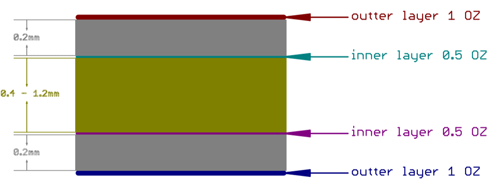

# PCIe Host Board
This card serves as host interface for serialized headstages. It is really just
a digital breakout for the FMC connector on the KC705 board. This board
roughly conforms the PCIe card mechanical standard and uses a flex FMC cable to
connect to the master FPGA module. This board performs all communication over
FMC. The PCIe slot design is for mechanical support and to provide a common and
standardized mounting solution across acquisition PCs

## Gerber Files


### Bill of Materials
The bill of materials for this device can be found
[here](https://docs.google.com/spreadsheets/d/18WfmbLGt8bGUUdksKp6AKA_wMX2SJ3Tndin-nnEgUCs/edit?usp=sharing).

## Manufacturing Requirements
In order to meet approximately correct trace impedances, the design further is
assuming the following stackup:

### Pinout
FMC LPC pinout can be found
[here](https://docs.google.com/spreadsheets/d/18WfmbLGt8bGUUdksKp6AKA_wMX2SJ3Tndin-nnEgUCs/edit#gid=584734392)

## Future Direction
Eventually, we hope to integrate this board and the KC705 into a single board.
This board will allow VITA-57 compliant IO modules for communication with
headstages and external equipment. Alternatively, we may make this board into a
VITA-57 compliant daughter card to interface with existing PCIe breakouts (e.g.
the [Numato
Nereid](https://numato.com/product/nereid-kintex-7-pci-express-fpga-development-board))
